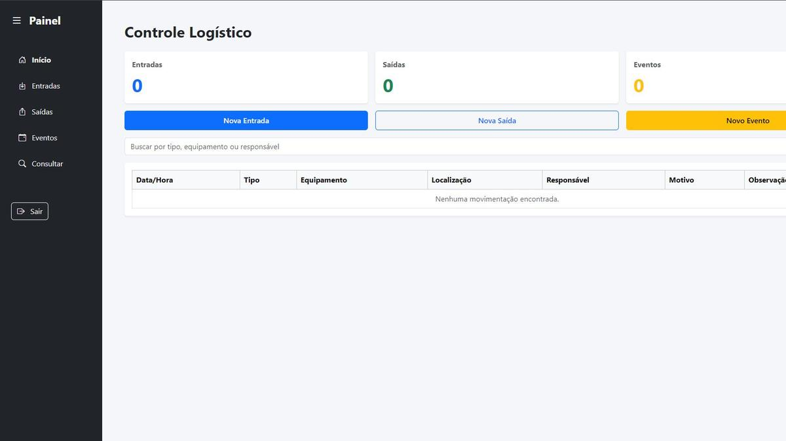
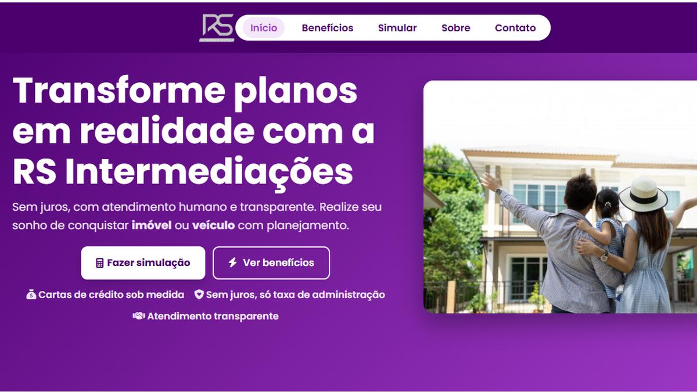
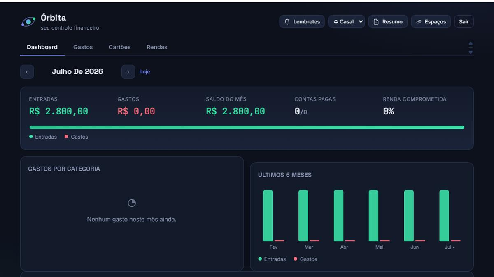
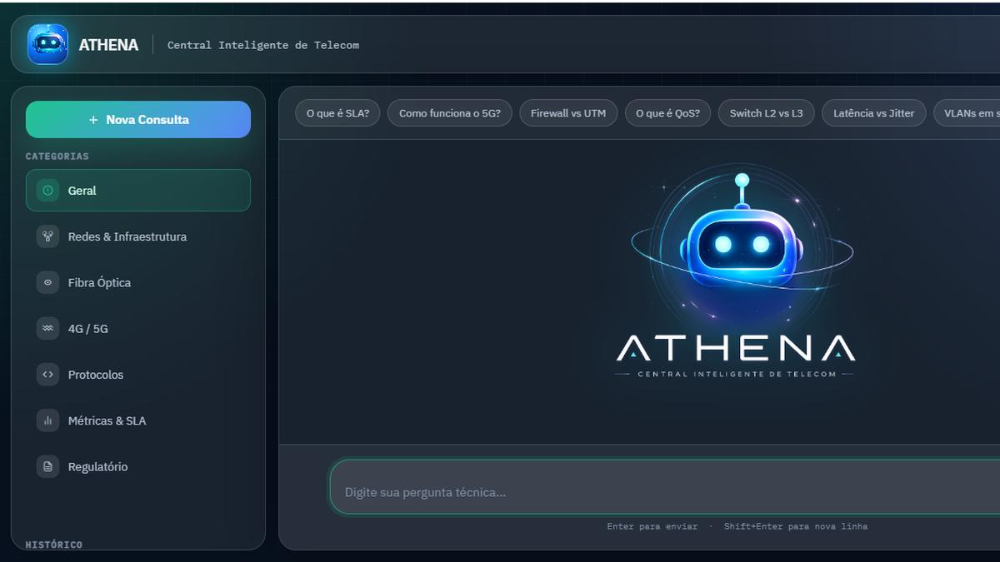

# ✦ Portfólio de Projetos | Kathleen Dias

<div align="center">

### Desenvolvedora Front-end

**Interfaces que nascem de necessidades reais.**  
Sites, sistemas e soluções digitais construídos do rascunho ao deploy.

[](https://kathleenldi.github.io/portfolio-de-projetos/)
[](https://github.com/KathleenLDi)
[](https://www.linkedin.com/in/kathleen-dias-84980a142/)

</div>

---

## 👩‍💻 Sobre o portfólio

Este repositório reúne alguns dos projetos que desenvolvi a partir de **necessidades reais de negócio e operação**.

Meu foco é criar interfaces claras, responsivas e fáceis de usar, conectando o front-end à lógica necessária para que o projeto realmente funcione — seja um site comercial, um sistema de gestão ou uma solução com inteligência artificial.

O portfólio foi desenvolvido em **HTML, CSS e JavaScript**, com identidade visual própria, animações e elementos inspirados em código.

### Tecnologias que aparecem nos meus projetos


---

# 🚀 Projetos em destaque

## 🐾 Cantinho do Banho


**Site institucional + sistema de gestão para um pet shop.**

O projeto une a experiência do cliente com a operação interna da empresa. O site direciona para o agendamento, enquanto o sistema auxilia no controle de pedidos, agenda, retirada dos pets, estoque, vendas, boletos, funcionários e faturamento.

**Tecnologias:** `HTML` · `CSS` · `JavaScript` · `MySQL`

🔗 [Ver site](https://www.cantinhodobanho.com.br)  
💻 [Ver repositório](https://github.com/KathleenLDi/Cantinho-do-banho-CERTO)

---

## 📡 Logitel



**Sistema para controle logístico de equipamentos de telecomunicações.**

Permite registrar entradas, saídas e eventos, mantendo informações como equipamento, localização, responsável, motivo e horário. A consulta dos registros ajuda a acompanhar por onde cada equipamento passou e organizar a operação.

**Tecnologias:** `JavaScript` · `HTML` · `CSS`

🔗 [Ver projeto](https://kathleenldi.github.io/logitel1/)  
💻 [Ver repositório](https://github.com/KathleenLDi/logitel1)

---

## 💼 R&S Intermediações



**Site institucional para uma consultoria de consórcios.**

A interface apresenta os serviços e as opções de cartas de crédito para imóveis, veículos, caminhões e máquinas agrícolas, conduzindo o visitante até a simulação e o contato comercial.

**Tecnologias:** `HTML` · `CSS` · `JavaScript`

🔗 [Ver site](https://www.rsinter.com.br)  
💻 [Ver repositório](https://github.com/KathleenLDi/Projeto-consorcio)

---

## 💜 Órbita



**Controle financeiro pessoal e compartilhado.**

Projeto criado para reunir entradas, gastos, saldo do mês, contas pagas, renda comprometida, categorias e comparativos financeiros em uma experiência visual simples de acompanhar.

> 🚧 Projeto em evolução.

**Tecnologias:** `JavaScript` · `CSS`

🔗 [Ver projeto](https://kathleenldi.github.io/-orbita-controle-financeiro-/)  
💻 [Ver repositório](https://github.com/KathleenLDi/-orbita-controle-financeiro-)

---

## 🤖 Athena



**Central inteligente de apoio ao suporte de telecomunicações.**

A proposta é permitir que o atendente faça perguntas em linguagem natural e receba respostas relacionadas a redes, fibra óptica, 4G/5G, protocolos, métricas, SLA e assuntos regulatórios. A aplicação utiliza um servidor Node.js integrado à API do Gemini.

> 🚧 Projeto em construção.

**Tecnologias:** `HTML` · `CSS` · `JavaScript` · `Node.js` · `Gemini API`

🔗 [Ver projeto](https://kathleenldi.github.io/IA-Telecom/)  
💻 [Ver repositório](https://github.com/KathleenLDi/IA-Telecom)

---

## 🧩 Como este portfólio foi construído

```text
portfolio-de-projetos/
│
├── index.html          # conteúdo e estrutura
├── css/
│   └── estilo.css      # identidade visual e responsividade
├── js/
│   └── script.js       # interações e animações
├── imagens/            # telas dos projetos
└── mascote.svg         # ilustração utilizada na identidade
```

O site foi escrito sem framework, trabalhando diretamente com **HTML, CSS e JavaScript**.

---

## 🌐 Acesse o portfólio

### 👉 [kathleenldi.github.io/portfolio-de-projetos](https://kathleenldi.github.io/portfolio-de-projetos/)

---

<div align="center">

### Kathleen Dias

`Front-end` · `Interfaces Web` · `Sistemas` · `APIs` · `IA`

**Transformando problemas reais em produtos digitais claros e funcionais.**

</div>
